<h3><code>lucas@github:~$ ./contributions.sh</code></h3>

 
<h3><code>lucas@github:~$ whoami</code></h3>
<table><tr>
<td valign="top"></td>
<td valign="top"></td>
</tr></table>
Engenharia elétrica, energia e software. 
Automações rastreáveis e ferramentas para decisões técnicas.
 
<h3><code>lucas@github:~$ ls ./projects</code></h3>

| Project | Focus |
| :--- | :--- |
| [Prospecta Nicho](https://github.com/luscaarmstrong1/prospecta-nicho) | Prospecção B2B e bases comerciais · TypeScript / Next.js |
| [Solar PV Digital Twin & BESS](https://github.com/luscaarmstrong1/solar-pv-digital-twin-bess-platform) | Digital twin, desempenho fotovoltaico e otimização BESS · Python |
| [Energy Intelligence AI](https://github.com/luscaarmstrong1/energy-intelligence-ai-platform) | Inteligência energética · Python |
| [Conexium Engenharia](https://github.com/luscaarmstrong1/conexium-engenharia) | Engenharia elétrica, consultoria e perícias · Astro |
| [Omega Imports](https://github.com/luscaarmstrong1/omegaimports-catalogo) | Catálogo web de produtos · HTML |

 <code>energy → data → engineering → automation</code> 
Original SVGs · public GitHub data · updated daily by GitHub Actions 
<a href="./scripts/README.md">How this profile is built</a>

